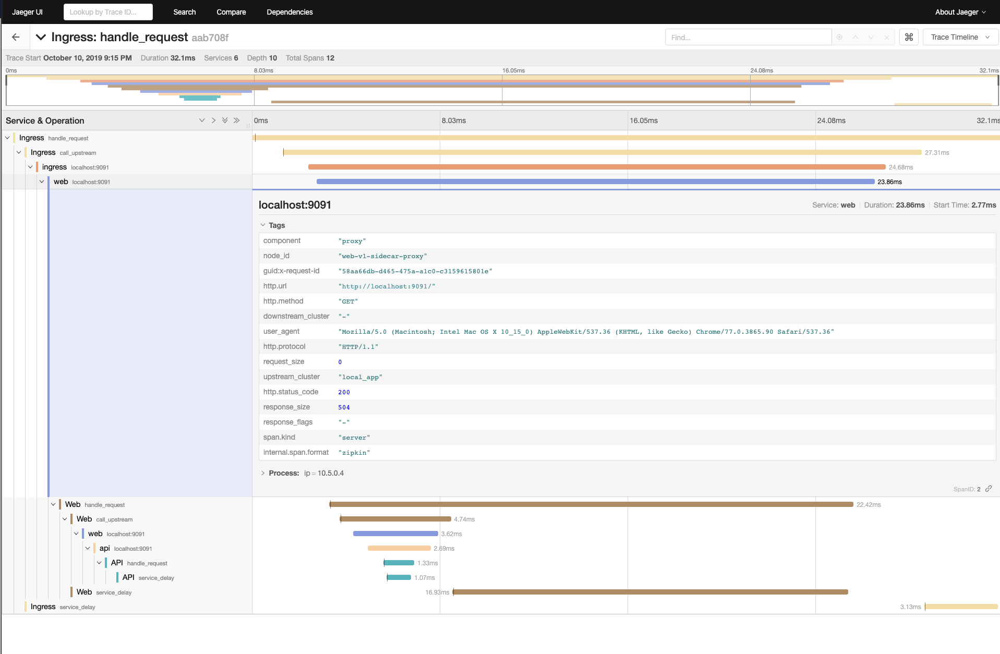

# Consul Service Mesh Tracing Demo
This repository contains two examples showing distributed tracing with Consul Service Mesh.

Both examples require Docker and Docker Compose.

## Jaeger [/jaeger](/jaeger)
Standalone example showing how Zipkin tracing can be used with Consul Service Mesh and collected by Jaeger.

## Datadog [/datadog](/datadog)
Example showing how [Datadog](http://datadoghq.com) can be used with Consul Service Mesh to view distributed tracing, metrics and logs.

