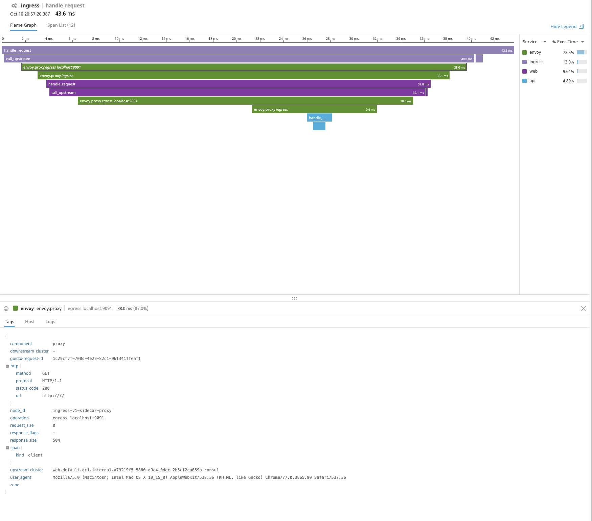
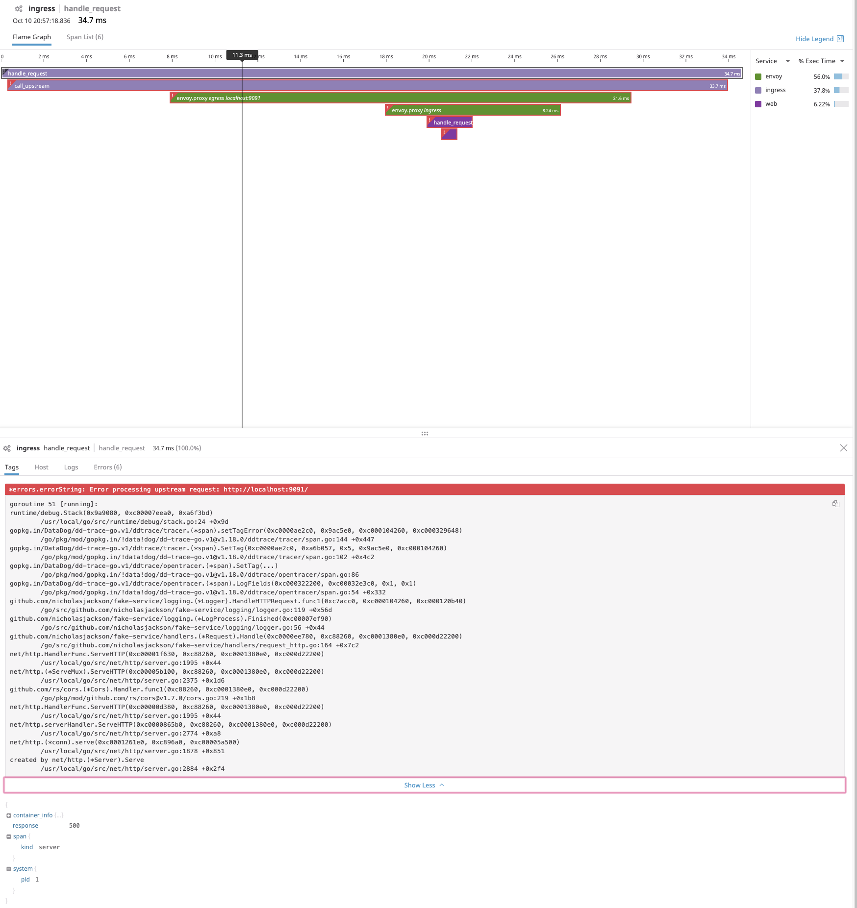

Datadog Tracing with Consul Service Mesh
This demo consists of three services Ingress (HTTP), Web (HTTP), and API (gRPC)  which are configured to communicate using Consul Service Mesh. 

```
ingress (HTTP) --
                  web (HTTP) --
                                api (gRPC, 20% error rate)
```

Tracing, metrics and logging have been configured for the application instances and Envoy proxy. All data is exported to 
the Datadog platform [http://datadoghq.com](http://datadoghq.com).

This example requires a valid DataDog API key, you can obtain this by signing up for an account at (https://app.datadoghq.com). Once you have
a DataDog API key this must be set as an environment variable so that the datadog-agent can communicate with the API.

```
export DD_API_KEY=my_key
```

## Running the Demo
The demo can be started using Docker Compose with the following command:

```
consul-demo-tracing/datadog on  master [?] via 🐹 v1.13.1 on 🐳 v19.03.2
➜ docker-compose up
Creating network "datadog_vpcbr" with driver "bridge"
Creating datadog_datadog-agent_1 ... done
Creating datadog_ingress_1       ... done
Creating datadog_web_1           ... done
Creating datadog_consul_1        ... done
Creating datadog_api_1           ... done
Creating datadog_api_proxy_1     ... done
Creating datadog_web_proxy_1     ... done
Creating datadog_ingress_envoy_1 ... done
Attaching to datadog_api_1, datadog_web_1, datadog_datadog-agent_1, datadog_consul_1, datadog_ingress_1, datadog_web_proxy_1, datadog_api_proxy_1, datadog_ingress_envoy_1
api_1            | {"@level":"info","@message":"Starting service","@timestamp":"2019-10-10T20:25:32.199874Z","listenAddress":"0.0.0.0:9090","name":"API","service type":"grpc","upstreamURIs":"","upstreamWorkers":"1"}
web_1            | {"@level":"info","@message":"Starting service","@timestamp":"2019-10-10T20:25:32.212991Z","listenAddress":"0.0.0.0:9090","name":"Web","service type":"http","upstreamURIs":"grpc://localhost:9091","upstreamWorkers":"1"}
web_1            | {"@level":"info","@message":"Adding handler for UI static files","@timestamp":"2019-10-10T20:25:32.213264Z"}
consul_1         | BootstrapExpect is set to 1; this is the same as Bootstrap mode.
consul_1         | bootstrap = true: do not enable unless necessary
ingress_1        | {"@level":"info","@message":"Starting service","@timestamp":"2019-10-10T20:25:32.610708Z","listenAddress":"0.0.0.0:9090","name":"Ingress","service type":"http","upstreamURIs":"http://localhost:9091","upstreamWorkers":"1"}
```

## Consul
Once running the consul UI is accessible at [http://localhost:8500](http://localhost:8500), you can also access the Consul API at the same address.
Service registration and the application of central config is applied when starting the application. The config files
can be found at the following locations:
* Consul Config [consul_config/config.hcl](consul_config/config.hcl)
* Central Config to set service protocol [central_config/](central_config/)
* Service Config for registering services and configuring upstreams [service_config/](service_config/)


## Interacting with the application
The main entry point for the system is accessible at [http://localhost:9090](http://localhost:9090), you can either 
interact with it using the UI [http://localhost:9090/ui](http://localhost:9090/ui).


Or by directly curling the main service API:

```
consul-demo-tracing on  master [?] via 🐹 v1.13.1
➜ curl localhost:9090
{
  "name": "Ingress",
  "uri": "/",
  "type": "HTTP",
  "start_time": "2019-10-10T20:10:11.590226",
  "end_time": "2019-10-10T20:10:11.630163",
  "duration": "39.9377ms",
  "body": "Hello World",
  "upstream_calls": [
    {
      "name": "Web",
      "uri": "http://localhost:9091",
      "type": "HTTP",
      "start_time": "2019-10-10T20:10:11.605254",
      "end_time": "2019-10-10T20:10:11.627063",
      "duration": "21.932ms",
      "body": "Web response",
      "upstream_calls": [
        {
          "name": "API",
          "uri": "grpc://localhost:9091",
          "type": "gRPC",
          "start_time": "2019-10-10T20:10:11.616201",
          "end_time": "2019-10-10T20:10:11.617864",
          "duration": "1.6636ms",
          "body": "API response",
          "code": 0
        }
      ],
      "code": 200
    }
  ],
  "code": 200
}
```

The API service has been configured to return an error approximately 20% of all calls.

## Tracing, Metrics and Logging
The 3 services and their associated Envoy proxies are configured to emit tracing, metrics, and log information to Datadog
where it can be queried using the APM (Tracing), Metrics, and Logs tools. You can view this information by 
logging into your Datadog account at [http://datadoghq.com](http://datadoghq.com).

### Example trace in Datadog



### Example trace with errors



## Stopping the demo
To cleanly remove all containers and networks, please use the following command:

```
consul-demo-tracing/datadog on  master [?] via 🐹 v1.13.1 on 🐳 v19.03.2 took 3m 4s
➜ docker-compose down
Removing datadog_ingress_envoy_1 ... done
Removing datadog_web_proxy_1     ... done
Removing datadog_api_proxy_1     ... done
Removing datadog_api_1           ... done
Removing datadog_datadog-agent_1 ... done
Removing datadog_consul_1        ... done
Removing datadog_ingress_1       ... done
Removing datadog_web_1           ... done
Removing network datadog_vpcbr
```
